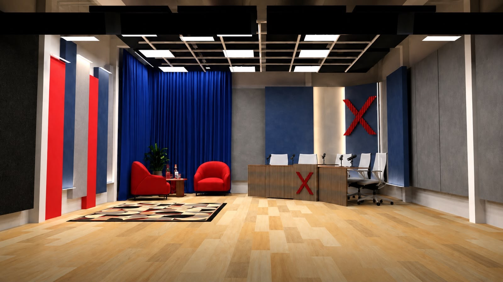

# Tercer Tiempo — biblia de formato

**Productora:** Nexo Studios
**Emisión:** miércoles y domingos, 20:00 a 22:00
**Estado:** formato definido. Faltan los nombres del elenco y el primer sponsor.

---

## El formato

**Nombre:** Tercer Tiempo
**Bajada:** Amistad · Pasión · Música

**Qué es:** el pospartido del picado del miércoles. Seis amigos que se juntan después de jugar,
con la birra en la mesa y la charla que sale sola cuando ya no importa el resultado.

**La promesa:** distensión y humor. No se informa, no se analiza, no se baja línea. Se habla de lo
que hablarías vos con tus amigos el miércoles a la noche.

**El tono:** nadie es periodista. Nadie explica. Se opina fuerte, se carga al de al lado y se dice
"no sé" cuando no se sabe. El día que la mesa suene informada y equilibrada, dejó de ser un tercer
tiempo.

**La regla de oro:** el que mira tiene que sentir que le falta una silla en esa mesa. Si siente que
está viendo un programa, algo se hizo de más.

---

## Los dos días

La mesa es la misma y el esqueleto también. Lo que cambia es a qué viene la gente: el miércoles a
cortar la semana, el domingo a cerrarla.

### Miércoles — el corte de la semana

Espectáculo, música, cultura y humor. El programa de distensión pura: llegás cansado a mitad de
semana y esto es el corte.

- **Vivo musical.** Una banda o un artista tocando en el piso. La pata musical de la marca, en vivo
  y no contada.
- **Invitado del espectáculo.** Alguien de la música, la tele o la cultura. Se sienta en la mesa como
  uno más, no como entrevistado.
- **Entretenimiento y juego.** El desafío, las cargadas, lo que no tiene ninguna utilidad y por eso
  funciona.
- **El tercer tiempo largo.** El miércoles la mesa se estira: es el día donde la charla manda por
  encima de la escaleta.

### Domingo — el cierre de la semana

Resumen deportivo y balance. Lo que dejó la fecha, lo que hicimos nosotros, y el arranque de lo que
viene.

- **Resumen deportivo.** La semana en fútbol, con acento en la liga local y en los torneos de la zona.
- **Los clubes y lo viral.** Lo que se grabó en los terceros tiempos de la semana y lo que explotó de ahí.
- **Anécdotas, temáticas y efemérides.** El costado de sobremesa: qué pasó un día como hoy, la
  historia que nadie se acordaba.
- **Lo que viene.** Empieza el análisis de la semana siguiente. El domingo cierra y abre a la vez.

---

## El piso

El programa sale del estudio de Nexo Studios, y el estudio ya viene resuelto en dos ambientes: el
escritorio y el living. Eso no es un detalle de decorado — es lo que le da al programa dos registros
distintos sin cambiar de set.

| Zona | Qué es | Estado |
|---|---|---|
| **Mesa** — el escritorio | Frente de listones y micrófonos ya montados. Posición de arranque: apertura, B1 y todo lo que necesite los seis a cámara. | Hoy hay cinco sillas a la vista; falta sumar la sexta |
| **Living** — los sillones | Sillones rojos, mesa baja y cortina de fondo. El registro distendido: invitado, vivo musical y brindis del cierre. | Sin micrófonos propios; hay que resolverlos |

### Cómo se usa cada zona

| Momento | Zona | Por qué |
|---|---|---|
| Apertura | Mesa | Los seis en cámara, de frente. Es la foto del programa. |
| B1 | Mesa | El bloque de más ida y vuelta: todos con micrófono y a la misma altura. |
| B2 · miércoles | Living | El invitado se sienta en el sillón, no del otro lado de un escritorio. |
| B2 · domingo | Mesa | Se comenta el material grabado en los clubes, con la pantalla de apoyo. |
| B3 · miércoles | Living | La banda toca contra la cortina. Fondo neutro y sin escritorio en el medio. |
| B3 · domingo | Mesa | Efemérides y semana que viene: vuelve el registro de mesa. |
| Cierre · el brindis | Living | Los seis de pie con el vaso en la mano. Es literalmente el tercer tiempo. |

**La zona living no tiene micrófonos montados.** Es lo primero a resolver: sin eso, la mitad de los
bloques del miércoles y el cierre de los dos días no se pueden hacer ahí.

**Cámaras:** tres. Una general, una sobre la mesa y una sobre el living.

### Cómo se viste el piso

El estudio es rojo, azul y gris — los colores de Nexo Studios. Tercer Tiempo es verde sobre negro.
No hay que remodelar nada: se resuelve con luz, con el frente del escritorio y con las placas.

- **Luz.** Los paneles acústicos azules toman color parejo. Un baño verde en los cabezales cambia el
  clima del estudio entero sin tocar una pared.
- **Escritorio.** Una placa o vinilo verde con el isotipo TT sobre el frente de listones, tapando la
  X. Es el plano que más sale al aire.
- **La X.** La X iluminada de la pared queda como crédito de Nexo Studios: se apaga durante el
  programa y se enciende en el cierre.
- **Atrezzo.** Vasos, botella y pelota sobre la mesa baja del living. Es lo que hace que el living
  lea como tercer tiempo y no como sala de espera.

---

## Guion técnico

El mismo esqueleto los dos días: apertura, tres bloques de treinta y tres minutos, tres tandas y
cierre. **Dos horas exactas, de 20:00 a 22:00.** Lo que cambia es qué entra en cada bloque.

| Hora | Dur. | Miércoles | Domingo |
|---|---|---|---|
| 20:00 | 4' | **Apertura** — cabecera, los seis en cámara, el titular de la noche | *ídem* |
| 20:04 | 33' | **B1 · El corte** — el tema de la semana, espectáculo y cultura | **B1 · La fecha** — resumen deportivo de la semana |
| 20:37 | 4' | *Tanda 1* | *Tanda 1* |
| 20:41 | 33' | **B2 · El invitado** — figura del espectáculo o la cultura, es uno más | **B2 · Los terceros tiempos** — lo grabado en los clubes y lo viral |
| 21:14 | 4' | *Tanda 2* | *Tanda 2* |
| 21:18 | 33' | **B3 · El vivo** — música en vivo en el piso y el desafío | **B3 · Lo que viene** — anécdotas, efemérides y la semana siguiente |
| 21:51 | 4' | *Tanda 3* | *Tanda 3* |
| 21:55 | 5' | **Cierre · El brindis** — lo mejor de la noche y qué viene la próxima | *ídem* |

**Total: 120 minutos exactos. 12 minutos vendibles en tanda.**

El domingo tiene un bloque grabado — los terceros tiempos en B2. Son treinta y tres minutos de aire que se
producen durante la semana y no en vivo.

---

## Las columnas

Cada columnista es dueño de una columna con nombre propio. Eso hace que la escaleta se escriba sola
y que nadie esté sentado de adorno.

| Columna | Dueño | Día | Qué es |
|---|---|---|---|
| **La fecha** | Columnista 1 | Domingo | El resumen deportivo de la semana, con acento en la liga local |
| **El vivo** | Columnista 2 | Miércoles | La música: quién toca en el piso y por qué |
| **Los clubes** | Columnista 3 | Domingo | Lo grabado en los terceros tiempos y lo que se hizo viral |
| **El desafío** | Columnista 4 | Miércoles | Juego con el invitado. Formato fijo, se repite siempre igual |
| **Efemérides** | Co-conductor | Domingo | Qué pasó un día como hoy. El costado de sobremesa del cierre |

**Una columna rota.** Cada cuatro o cinco semanas uno de los cuatro cede su lugar para probar algo
nuevo. La que funciona se queda. Un formato sin lugar para probar se vuelve viejo en el mes tres.

---

## Estrategia de contenido

### El tráiler en la cancha

Se graba en una cancha, después de un picado de verdad. Los seis en el tercer tiempo real: la mesa
larga, la birra, los botines todavía puestos, el pelo mojado. Sin luces de estudio y sin cámara de
piso.

No cuenta de qué se trata el programa: lo muestra. El que lo ve entiende en quince segundos que esto
no es un panel, es una junta — y esa es toda la propuesta.

**Sale dos semanas antes del programa 1.** Vertical para Instagram y TikTok, y una versión
horizontal para la placa de apertura.

### Tercer Tiempo en los torneos

Todas las semanas el equipo va al tercer tiempo de un torneo de fútbol amateur de la zona y graba de
qué se habla ahí: el partido que se jugó, el que se pudrió, el que mete todos los goles, el que
nunca llega a tiempo.

Cada nota se titula igual: *el tercer tiempo de [equipo] · [torneo], [ciudad]*. Es una serie, y como
serie se reconoce por lo que se repite.

1. **Se elige el torneo** — uno por semana, de la zona o alrededores.
2. **Se avisa al club** — el club sabe que va a salir al aire el domingo y lo cuenta a sus jugadores.
3. **Se graba el tercer tiempo** — después del partido, en la mesa del equipo. La misma pregunta fija
   a todos, más lo que salga.
4. **Sale en B2 del domingo** — veinte minutos de aire ya producidos antes de encender el piso.
5. **El club lo comparte** — cada equipo que sale mueve el material entre los suyos.

Sirve para tres cosas a la vez: llena un bloque entero del domingo, arma comunidad club por club, y
es un producto vendible al propio torneo.

### Los clips

Dos programas de dos horas por semana dan de sobra para doce verticales sin filmar
nada nuevo. El vivo lo ven los que ya te conocen; los clips traen a los que no.

**Mínimo seis clips por programa**, cortados al día siguiente y publicados de forma escalonada hasta
la próxima emisión.

---

## La semana de producción

| Día | Qué pasa | Deadline |
|---|---|---|
| **Lunes** | Reunión de producción, una hora. Se cierra invitado del miércoles y tema de la mesa. | 21:00 |
| **Martes** | Guion técnico cerrado. Placas y separadores a técnica. | 20:00 |
| **Miércoles** | 17:00 llegada · 18:00 prueba de sonido, seis canales · 19:30 en posición | **Aire 20:00** |
| **Jueves** | Corte de clips del miércoles. Mínimo seis verticales. | 18:00 |
| **Viernes** | Se confirma el torneo del fin de semana y se avisa al club. | 22:00 |
| **Sábado** | Se graba el tercer tiempo del torneo. Edición esa misma noche. | 23:00 |
| **Domingo** | 17:00 llegada · 18:00 prueba · 19:30 en posición. Nota lista y cargada. | **Aire 20:00** |

**Si el lunes a las 21:00 no hay invitado confirmado, el miércoles es programa de mesa.** No se sale
a buscar invitado el martes: sale mal y quema el contacto.

### Fuera de cámara

| Puesto | Responsabilidad |
|---|---|
| **Productor general** | Escaleta, invitados, que el programa exista |
| **Técnica** | Switcher, seis canales de audio, placas, grabación del máster |
| **Cámara** | Tres: una general de mesa y dos móviles sobre los sectores |
| **Piso** | Cortes de tanda, agua, hace entrar y salir al invitado |

---

## Próximos pasos

1. **Los seis nombres en sus sectores** — quién conduce, quién co-conduce, y qué columna se lleva
   cada uno de los cuatro. *Esta semana.*
2. **Dónde se graba** — el piso define las tres cámaras y los seis canales de audio. *Esta semana.*
3. **La cancha del tráiler** y la fecha del picado. *Esta semana.*
4. **El primer torneo** — un club de la zona que acepte que vayamos a su tercer tiempo. *Semana 2.*
5. **El primer sponsor de bloque** — rubro bebida, B1. En canje si hace falta. *Semana 2.*

---

## Identidad

> Lo comercial vive en un documento aparte:
> [kit de marca y sponsoreo](tercer-tiempo-kit-sponsoreo.md).

Los valores no están estimados a ojo: se muestrearon del archivo original del logo
(`marca/logo-tercer-tiempo.jpg`, 1170 × 1205) con la misma metodología que
[la identidad de Iniciativa Global](../marca/identidad-visual.md).

| Rol | Color | Dónde se muestreó |
|---|---|---|
| **Verde Tercer Tiempo** | `#5DC825` | Anillo del isotipo y la palabra "TIEMPO" |
| **Blanco pincelada** | `#E9E9E9` | "TERCER" y el monograma TT |
| **Negro base** | `#000000` | Fondo del arte |

El fondo del arte es negro pleno: cualquier pieza que use el logo tiene que ir sobre `#000`, o
aparece un recuadro gris alrededor.

**Marca de la productora:** Nexo Studios, azul `#5495E8` y rojo `#E8353A` sobre negro, con
"STUDIOS" en oro `#98836A`. Va en el cierre y en el pie de las piezas, nunca compitiendo con el
verde del programa.
